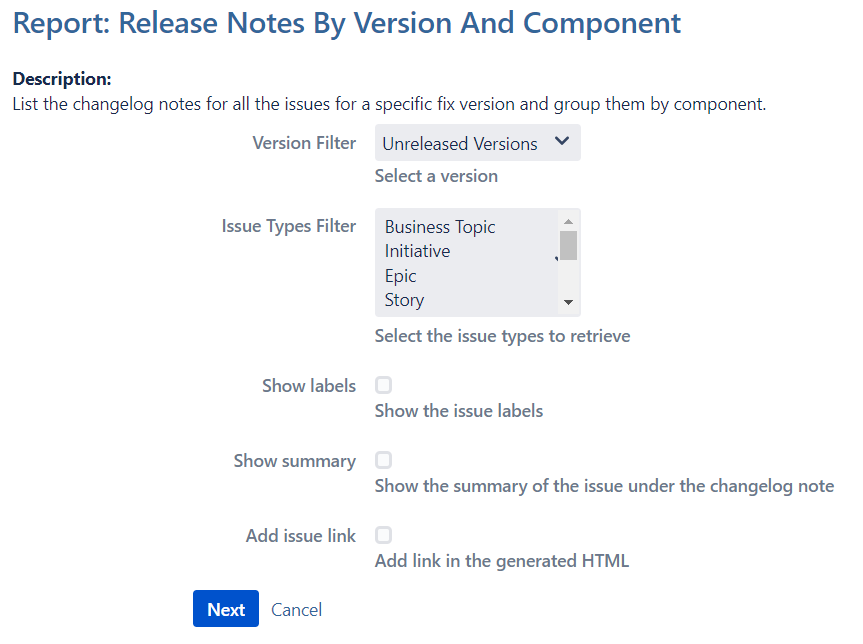
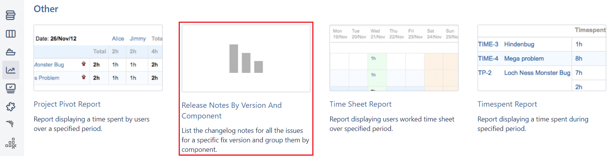

# Jira Report for Release Notes

This report has been created to build a Release Notes with issues grouped by version and component.
With the last version of the report you will have the following options available:

## Installation

Please note that this report uses a custom field **Changelog Notes** and if you do not have it it will uses the summary field by default.

To install this add-on follow these instructions:
- Get the latest version of the add-on and deploy it on your Jira instance
- In the project report tab you’ll see a new entry **Release Notes By Version And Component** in the **Other** section

- After a click on this entry, you'll see the configuration panel (see above)

## Tutorial

This module has been created following the Atlassian tutorial: https://developer.atlassian.com/server/jira/platform/creating-a-jira-report/

## Useful links

- Atlassian Developer Documentation: https://developer.atlassian.com/server/framework/atlassian-sdk/
- Report content type: https://developer.atlassian.com/server/jira/platform/report/
- API Javadoc: https://docs.atlassian.com/software/jira/docs/api/
- Simple configuration parameters: https://developer.atlassian.com/server/jira/platform/object-configurable-parameters/
